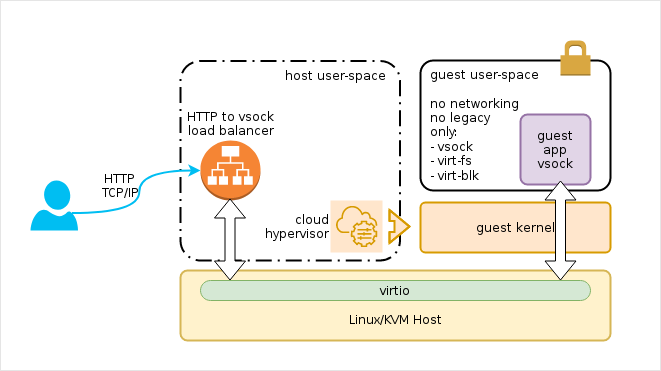

# `subscription-proxy-vsock`



The goal is to have a HTTP proxy that receives http requests,
and routes the requests over `virtio-vsock` to applications running
in one or more KVM virtual machines. For running KVM instances I use
[cloud-hypervisor](https://github.com/cloud-hypervisor/cloud-hypervisor).

The applications will run in a heavily confined VM (no networking, no legacy devices),
and they automatically register with the proxy (atypical to most proxies/load-balancers,
 but similar to mongrel2 or the uwsgi fastrouter/subscription). In that way, I can have
any number of them starting up and going away.


## Rough roadmap

0.1)
  listeners for http and vsock (or its emulation)

0.2)
  ping/pong protocol

0.3)
  http request, http response in protocol

0.4)
  register cmd (regex: hostname/path)

0.5)
  use splice or similar on the response path

0.6)
  weighted subscriber selection based on ping/pong latency

1.0)
- proper cli
- correct http request and response handling
- native vsock on the host side
- as robust as possible

2.0)
- io_uring

v.next)
- websockets
  request websocket:<uuid> ->
  <- connect websocket:<uuid>
- tls
- http2
- vm manager (cgi like)

## Quick start

### terminal 1:
```
cargo run
```

### terminal 2:
```
cloud-hypervisor \
    --cmdline "console=hvc0 panic=-1" \
    --kernel ./bzImage \
    --initramfs ./initramfs.img.lz4 \
    --vsock cid=10,sock=/tmp/cid10.sock
```
> more info how to prepare the guest kernel `bzImage` and `initramfs.img.lz4` at https://gist.github.com/gdamjan/1f260b58eb9fb1ba62d2234958582405.
> Make sure to add python and `vsock-demo.py` as `/init` in the initramfs. I'll automate this soon.

### terminal 3:
```
curl -v http://127.0.0.1:8888
```

## Links:

Request/Response serialization candidates:
- https://github.com/sbdchd/tnetstring/
- https://github.com/capnproto/capnproto-rust

cloud-hypervisor:
- https://github.com/cloud-hypervisor/cloud-hypervisor
- https://github.com/firecracker-microvm/firecracker/blob/master/docs/vsock.md

VSock:
- https://wiki.qemu.org/Features/VirtioVsock
- http://kvmonz.blogspot.com/p/knowledge-using-vsock.html
- http://man7.org/linux/man-pages/man7/vsock.7.html
